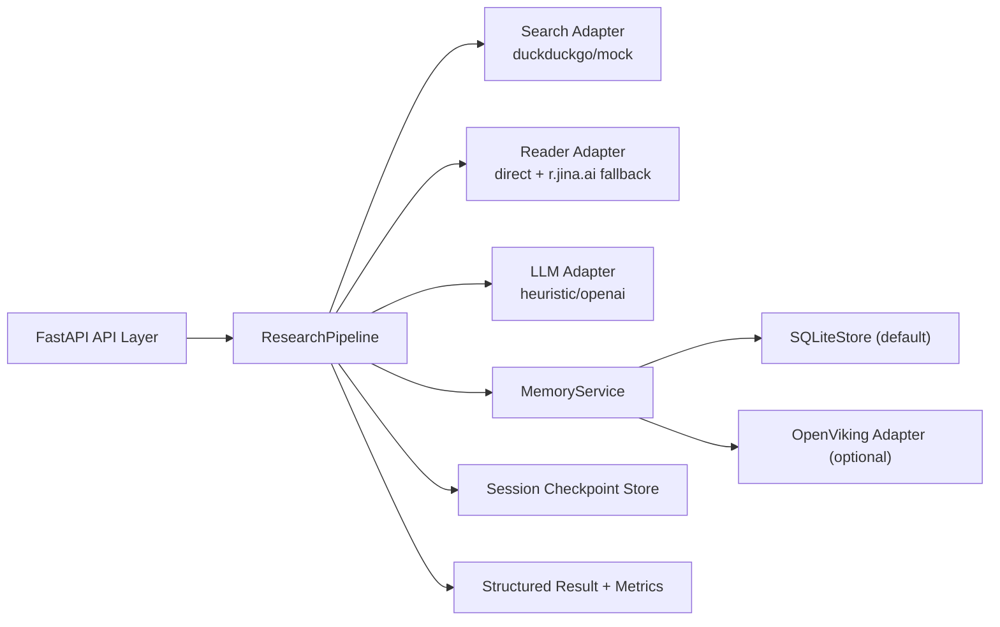

# DeepResearch-X

[](https://www.python.org/)
[](https://fastapi.tiangolo.com/)
[](https://pytest.org/)
[](docs/OPENVIKING_INTEGRATION.md)


面向深度研究任务的工程化 Agent 系统，提供可追踪证据链、分层记忆管理、可降级适配架构与可量化评测能力。

English (brief): A production-oriented deep research agent with traceable evidence, layered memory, graceful fallback, and measurable benchmark outputs.

## 核心能力
- 多轮研究流水线：`retrieve -> claim extraction -> evidence alignment -> report`
- 证据链可追踪：每条结论关联来源链接、相关分数、证据片段
- 页面富文本增强：`direct fetch -> Jina Reader fallback`
- 分层记忆机制：`session` / `global` / `hybrid`
- 异步记忆提取：去重、冲突标注、置信度更新
- 记忆注入预算：控制上下文大小，避免 prompt 膨胀
- 可插拔后端：默认 SQLite，支持 OpenViking 适配与自动回退
- 可观测性指标：延迟、成本估算、记忆命中、写入冲突等

## 架构设计


设计要点：
- 以 `ResearchPipeline` 为唯一编排入口，保证行为一致性。
- 通过 `adapter + protocol` 保持边界清晰，便于替换实现。
- 外部记忆服务失败不影响主流程，自动降级本地后端。

## 技术栈
- Python 3.10+
- FastAPI / Jinja2
- Pydantic v2
- httpx / lxml / ddgs
- pytest

## 快速开始
```powershell
cd D:/DUAN/APP/deepresearch-x
python -m venv .venv
.venv/Scripts/activate
pip install -r requirements.txt
Copy-Item .env.example .env
uvicorn deepresearch_x.app:app --reload
```

访问：
- [http://127.0.0.1:8000](http://127.0.0.1:8000)

## API 概览

### POST `/api/research`
请求示例：
```json
{
  "topic": "multi-agent deep research systems",
  "loops": 3,
  "top_k": 6,
  "session_id": "prod-session-001",
  "use_memory": true,
  "memory_backend": "sqlite",
  "memory_budget_tokens": 280,
  "memory_scope": "hybrid"
}
```

响应关键字段：
- `report_markdown`
- `final_claims`
- `sources`
- `metrics`
- `session_id`
- `memory_used_count`
- `memory_write_count`
- `memory_conflict_count`

### GET `/api/sessions/{session_id}`
- 返回会话 checkpoint 历史（含每次运行的指标快照）。

### GET `/api/memory/{session_id}`
- 返回会话相关记忆条目（支持 `memory_scope` 与 `memory_backend` 参数）。

## 配置说明
`.env` 关键项：

- Providers
- `SEARCH_PROVIDER=duckduckgo|mock`
- `LLM_PROVIDER=heuristic|openai`
- `OPENAI_MODEL=gpt-4.1-mini`

- Reader
- `ENABLE_PAGE_READER=true|false`
- `MAX_PAGE_FETCH_PER_LOOP=3`
- `MAX_PAGE_CHARS=12000`
- `READER_TIMEOUT_SECONDS=8`

- Cost
- `CHEAP_MODEL_COST_PER_1K=0.0006`
- `EXPENSIVE_MODEL_COST_PER_1K=0.005`

- Memory
- `ENABLE_MEMORY=true|false`
- `MEMORY_BACKEND=sqlite|openviking`
- `MEMORY_SQLITE_PATH=outputs/memory_store.db`
- `MEMORY_BUDGET_TOKENS=280`
- `MEMORY_SCOPE=session|global|hybrid`
- `MEMORY_QUEUE_WAIT_MS=220`

- OpenViking
- `OPENVIKING_BASE_URL=http://127.0.0.1:8100`
- `OPENVIKING_TIMEOUT_SECONDS=0.8`

更多细节见：
- [OpenViking Integration Notes](docs/OPENVIKING_INTEGRATION.md)

## 评测与产物

### 批量运行
```powershell
.venv/Scripts/activate
python scripts/run_benchmark.py --topics-file examples/benchmark_topics.jsonl --loops 3 --top-k 6 --output outputs/benchmark_results.jsonl
```

### 可复现离线运行
```powershell
$env:SEARCH_PROVIDER="mock"
python scripts/run_benchmark.py --topics-file examples/benchmark_topics.jsonl --loops 1 --top-k 3 --limit 3 --disable-memory --output outputs/mock_benchmark.jsonl
```

### 三路对比（Baseline / DeerFlow-style / OpenViking）
```powershell
$env:SEARCH_PROVIDER="mock"
python scripts/compare_benchmark.py --topics-file examples/benchmark_topics.jsonl --loops 2 --top-k 4 --limit 4 --output-dir outputs/compare
```

输出文件：
- `outputs/compare/memory_compare_results.jsonl`
- `outputs/compare/memory_ab_report.md`

## 开发与测试
```powershell
.venv/Scripts/activate
python -m pytest -q
```

当前测试覆盖：
- pipeline 主流程
- 记忆去重与冲突标注
- 记忆预算截断
- OpenViking fallback 契约
- 同 session 连续运行一致性

## 目录结构
```text
deepresearch-x/
  deepresearch_x/
    app.py
    config.py
    models.py
    pipeline.py
    memory/
      store.py
      service.py
      openviking.py
    adapters/
      search.py
      reader.py
      llm.py
    templates/
      index.html
    static/
      app.js
      styles.css
  scripts/
    run_benchmark.py
    compare_benchmark.py
  docs/
    OPENVIKING_INTEGRATION.md
    INTERVIEW_PLAYBOOK.md
    assets/
      architecture-cover.svg
  tests/
    test_pipeline.py
    test_memory.py
```

## 可靠性与降级策略
- 外部搜索不可用时：自动回退 `MockSearchProvider`
- 页面抓取失败时：自动回退 `r.jina.ai` Reader
- OpenViking 不可达时：自动回退 SQLite（含失败冷却）
- 所有路径保留结构化输出，避免“因单点失败导致全流程中断”

## Roadmap
- 增加异步任务队列（任务级并发调度）
- 增加质量评估模块（coverage / novelty / citation precision）
- 增加 CI 持续对比基准（回归质量门禁）
