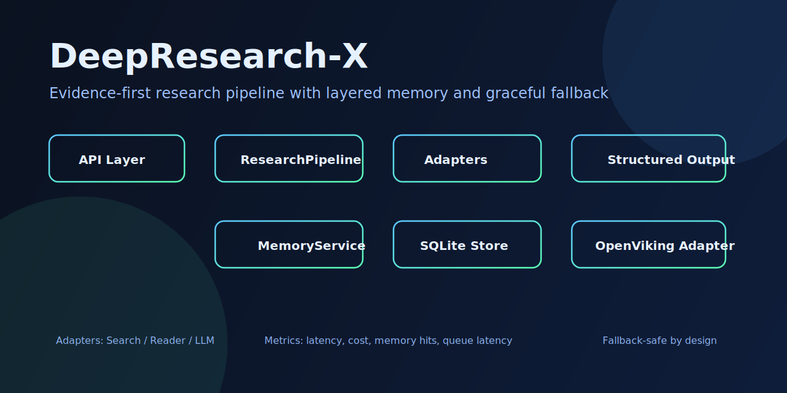
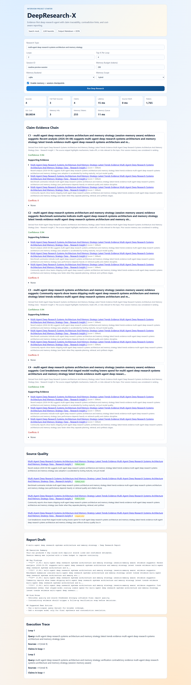
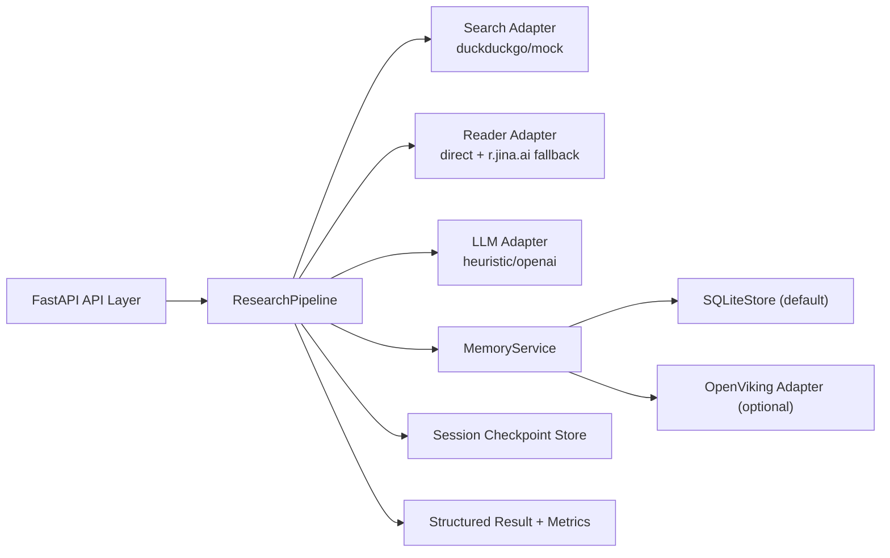

# DeepResearch-X

一个工程化的深度研究 Agent 系统，专注于证据链追踪、分层记忆、可降级架构与可量化评测。  
_A production-oriented deep research agent focused on traceability, layered memory, graceful fallback, and measurable benchmarking._

## Badges

**Core Stack**
[](https://www.python.org/)
[](https://fastapi.tiangolo.com/)
[](https://docs.pydantic.dev/)

**Quality**
[](https://github.com/Duang777/deepresearch-x/actions/workflows/ci.yml)
[](docs/OPENVIKING_INTEGRATION.md)

**Ecosystem**
[](#docs-index)
[](https://github.com/Duang777/deepresearch-x/stargazers)

## Quick Links

[](#docs-index)
[](#系统架构--architecture)
[](#快速开始--quick-start)
[](#api-概览--api-overview)
[](#运行与评测--operations--benchmarking)
[](https://github.com/Duang777/deepresearch-x/actions/workflows/ci.yml)

## Visual Preview



**Runtime Preview**



## Docs Index

| 文档 | 说明 | English |
|---|---|---|
| [README.md](README.md) | 项目总览、架构、API、运行与评测 | Project overview, architecture, API, operations |
| [docs/OPENVIKING_INTEGRATION.md](docs/OPENVIKING_INTEGRATION.md) | OpenViking 集成与运维手册 | OpenViking integration and operations guide |
| [docs/INTERVIEW_PLAYBOOK.md](docs/INTERVIEW_PLAYBOOK.md) | 开发运行与演示流程手册 | Developer runbook and demo procedure |

## 核心特性 | Core Capabilities

| 能力 | 说明 | English |
|---|---|---|
| 多轮研究流水线 | `retrieve -> claim extraction -> evidence alignment -> report` | Multi-loop orchestration pipeline |
| 证据链追踪 | 结论绑定来源 URL、相关度分数、证据片段 | Claim-to-source traceability |
| 富文本抓取增强 | `direct fetch` 失败时回退 `r.jina.ai` | Full-text enrichment with fallback |
| 分层记忆作用域 | `session` / `global` / `hybrid` | Layered memory scopes |
| 异步记忆提取 | 去重、冲突标注、置信度更新 | Async memory extraction and reconciliation |
| 记忆注入预算 | `memory_budget_tokens` 限制上下文体积 | Budgeted memory injection |
| 后端可插拔 | 默认 SQLite，支持 OpenViking 并自动降级 | Pluggable memory backends with graceful fallback |
| 量化评测 | Baseline / DeerFlow-style / OpenViking 对比 | Quantitative benchmarking and comparison |

## 系统架构 | Architecture



设计原则：
- 单一编排入口：`ResearchPipeline`
- 协议化边界：`adapter + protocol`
- 可降级优先：外部依赖异常时保持主链路可用

_Design principles: single orchestration entrypoint, protocol-driven boundaries, and graceful degradation by default._

## 快速开始 | Quick Start

```powershell
cd D:/DUAN/APP/deepresearch-x
python -m venv .venv
.venv/Scripts/activate
pip install -r requirements.txt
Copy-Item .env.example .env
uvicorn deepresearch_x.app:app --reload
```

访问地址：
- [http://127.0.0.1:8000](http://127.0.0.1:8000)

## 配置说明 | Configuration

`.env` 关键配置：

| 分类 | 配置项 | 默认值 |
|---|---|---|
| Provider | `SEARCH_PROVIDER` | `duckduckgo` |
| Provider | `LLM_PROVIDER` | `heuristic` |
| Provider | `OPENAI_MODEL` | `gpt-4.1-mini` |
| Reader | `ENABLE_PAGE_READER` | `true` |
| Reader | `MAX_PAGE_FETCH_PER_LOOP` | `3` |
| Reader | `MAX_PAGE_CHARS` | `12000` |
| Reader | `READER_TIMEOUT_SECONDS` | `8` |
| Cost | `CHEAP_MODEL_COST_PER_1K` | `0.0006` |
| Cost | `EXPENSIVE_MODEL_COST_PER_1K` | `0.005` |
| Memory | `ENABLE_MEMORY` | `true` |
| Memory | `MEMORY_BACKEND` | `sqlite` |
| Memory | `MEMORY_SQLITE_PATH` | `outputs/memory_store.db` |
| Memory | `MEMORY_BUDGET_TOKENS` | `280` |
| Memory | `MEMORY_SCOPE` | `hybrid` |
| Memory | `MEMORY_QUEUE_WAIT_MS` | `220` |
| Fallback | `ALLOW_SEARCH_MOCK_FALLBACK` | `false` |
| Fallback | `ALLOW_LLM_HEURISTIC_FALLBACK` | `false` |
| OpenViking | `OPENVIKING_BASE_URL` | `http://127.0.0.1:8100` |
| OpenViking | `OPENVIKING_TIMEOUT_SECONDS` | `0.8` |

## API 概览 | API Overview

### POST `/api/research`

请求示例：
```json
{
  "topic": "multi-agent deep research systems",
  "loops": 3,
  "top_k": 6,
  "session_id": "prod-session-001",
  "use_memory": true,
  "memory_backend": "sqlite",
  "memory_budget_tokens": 280,
  "memory_scope": "hybrid"
}
```

响应关键字段：
- `report_markdown`
- `final_claims`
- `sources`
- `metrics`
- `session_id`
- `memory_used_count`
- `memory_write_count`
- `memory_conflict_count`
- `degraded_mode`
- `degraded_reasons`

### GET `/api/sessions/{session_id}`
- 返回会话 checkpoint 历史和指标快照。

### GET `/api/memory/{session_id}`
- 返回会话记忆条目，支持 `memory_scope` 与 `memory_backend` 参数。

## 运行与评测 | Operations & Benchmarking

### 启动服务
```powershell
.venv/Scripts/activate
uvicorn deepresearch_x.app:app --reload
```

### 批量运行
```powershell
.venv/Scripts/activate
python scripts/run_benchmark.py --topics-file examples/benchmark_topics.jsonl --loops 3 --top-k 6 --output outputs/benchmark_results.jsonl
```

### 可复现离线模式
```powershell
$env:SEARCH_PROVIDER="mock"
python scripts/run_benchmark.py --topics-file examples/benchmark_topics.jsonl --loops 1 --top-k 3 --limit 3 --disable-memory --output outputs/mock_benchmark.jsonl
```

### 三路对比（Baseline / DeerFlow-style / OpenViking）
```powershell
$env:SEARCH_PROVIDER="mock"
python scripts/compare_benchmark.py --topics-file examples/benchmark_topics.jsonl --loops 2 --top-k 4 --limit 4 --output-dir outputs/compare
```

输出文件：
- `outputs/compare/memory_compare_results.jsonl`
- `outputs/compare/memory_ab_report.md`

## 质量保障 | Quality Gates

运行测试：
```powershell
.venv/Scripts/activate
python -m pytest -q
```

当前覆盖范围：
- pipeline 主流程回归
- 记忆去重与冲突标注
- 记忆注入预算限制
- OpenViking fallback 契约
- 同一会话多次运行一致性

## 项目结构 | Project Layout

```text
deepresearch-x/
  deepresearch_x/
    app.py
    config.py
    models.py
    pipeline.py
    memory/
      store.py
      service.py
      openviking.py
    adapters/
      search.py
      reader.py
      llm.py
    templates/
      index.html
    static/
      app.js
      styles.css
  scripts/
    run_benchmark.py
    compare_benchmark.py
  docs/
    OPENVIKING_INTEGRATION.md
    INTERVIEW_PLAYBOOK.md
    assets/
      architecture-cover.svg
      runtime-preview.png
  tests/
    test_pipeline.py
    test_memory.py
```

## 可靠性策略 | Reliability

- 搜索不可用：自动回退 `MockSearchProvider`
- 页面抓取失败：自动回退 `r.jina.ai` Reader
- OpenViking 不可达：自动回退 SQLite（含失败冷却）
- 保持结构化输出，避免单点失败导致流程中断

_Failure handling is built-in to keep the pipeline operational under partial outages._

## Roadmap

- 引入任务级异步编排队列
- 增加研究质量评估模块（coverage/novelty/citation precision）
- 接入 CI 持续基准对比与质量门禁
- 增加可观测性导出（Prometheus/OpenTelemetry）
