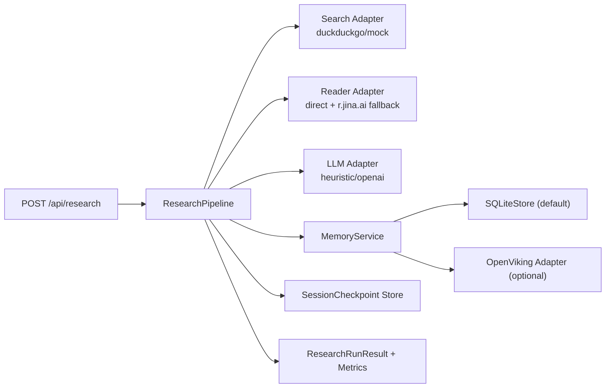

# DeepResearch-X

一个面向面试展示的深度研究 Agent 项目，强调三件事：
- 可追踪：Claim -> Evidence -> Source 链路完整
- 可延续：会话记忆与跨轮次上下文
- 可量化：基线与优化方案的 A/B 指标对比

English (short): Interview-focused deep research agent with traceability, memory continuity, and measurable benchmarking.

## 1. 项目亮点 | Highlights

### 中文
- 多轮研究流程：`retrieve -> claim extraction -> evidence alignment -> report`
- 证据可追踪：每条结论都能回到来源链接和证据片段
- 稳定抓取增强：`direct fetch -> Jina Reader fallback`
- DeerFlow 风格记忆：异步提取、去重、冲突标注、注入预算控制
- OpenViking 可选适配：不可用时自动回退本地 SQLite
- 评测闭环：支持 Baseline / DeerFlow-style / OpenViking 三路对比

### English
- Multi-loop orchestration with evidence-first reporting.
- DeerFlow-style memory queue with budgeted injection.
- Optional OpenViking adapter with SQLite fallback.
- Quantitative comparison scripts for interview storytelling.

## 2. 架构总览 | Architecture



中文说明：
- 核心编排在 `ResearchPipeline`。
- `memory_backend` 可切换 `sqlite` 或 `openviking`。
- OpenViking 接口失败时自动降级，不阻塞主流程。

English note:
- Adapter boundaries keep the core pipeline stable while swapping memory backends.

## 3. 快速开始 | Quick Start

```powershell
cd D:/DUAN/APP/deepresearch-x
python -m venv .venv
.venv/Scripts/activate
pip install -r requirements.txt
Copy-Item .env.example .env
uvicorn deepresearch_x.app:app --reload
```

打开：
- [http://127.0.0.1:8000](http://127.0.0.1:8000)

English:
- Run the commands above and open the local web UI.

## 4. 面试 5 分钟演示路线 | 5-Minute Demo Path

1. 在 UI 中输入主题，先跑一次（默认 `sqlite` + memory on）。
2. 保持同一个 `session_id` 再跑一次，展示记忆命中与上下文延续。
3. 调用 `GET /api/sessions/{session_id}` 展示 checkpoint。
4. 运行对比脚本并打开 `memory_ab_report.md` 讲量化结果。

```powershell
.venv/Scripts/activate
$env:SEARCH_PROVIDER="mock"
python scripts/compare_benchmark.py --topics-file examples/benchmark_topics.jsonl --loops 1 --top-k 3 --limit 3 --output-dir outputs/compare
```

English:
- Show continuity, observability, and measurable deltas in one flow.

## 5. API 使用 | API

### POST `/api/research`

请求示例：
```json
{
  "topic": "multi-agent deep research systems",
  "loops": 3,
  "top_k": 6,
  "session_id": "interview-demo-01",
  "use_memory": true,
  "memory_backend": "sqlite",
  "memory_budget_tokens": 280,
  "memory_scope": "hybrid"
}
```

关键返回字段：
- `session_id`
- `final_claims`
- `sources`（`fetch_status`, `content_preview`）
- `metrics`（延迟、成本、memory 指标）
- `memory_used_count`, `memory_write_count`, `memory_conflict_count`

### GET `/api/sessions/{session_id}`
- 查看该会话的 checkpoint 历史与每轮指标快照。

### GET `/api/memory/{session_id}?memory_scope=hybrid&memory_backend=sqlite`
- 查看会话/全局记忆条目及来源信息。

English:
- The API supports both single-run outputs and session-level memory inspection.

## 6. 记忆机制 | Memory Design

### 中文
- 上下文分层：
- `L0` 当前查询与实时检索结果
- `L1` 当前会话记忆
- `L2` 全局长期记忆
- 注入预算：
- `memory_budget_tokens` 限制注入上下文大小，防止 prompt 膨胀。
- 异步提取：
- 每轮 claims 结束后进入后台队列，执行去重、冲突标注与置信度更新。

### English
- Memory is layered (L0/L1/L2), budgeted, and asynchronously ingested.

## 7. 配置项 | Configuration

`.env` 关键变量：

- Providers:
- `SEARCH_PROVIDER=duckduckgo|mock`
- `LLM_PROVIDER=heuristic|openai`
- `OPENAI_MODEL=gpt-4.1-mini`

- Reader:
- `ENABLE_PAGE_READER=true|false`
- `MAX_PAGE_FETCH_PER_LOOP=3`
- `MAX_PAGE_CHARS=12000`
- `READER_TIMEOUT_SECONDS=8`

- Cost:
- `CHEAP_MODEL_COST_PER_1K=0.0006`
- `EXPENSIVE_MODEL_COST_PER_1K=0.005`

- Memory:
- `ENABLE_MEMORY=true|false`
- `MEMORY_BACKEND=sqlite|openviking`
- `MEMORY_SQLITE_PATH=outputs/memory_store.db`
- `MEMORY_BUDGET_TOKENS=280`
- `MEMORY_SCOPE=session|global|hybrid`
- `MEMORY_QUEUE_WAIT_MS=220`

- OpenViking:
- `OPENVIKING_BASE_URL=http://127.0.0.1:8100`
- `OPENVIKING_TIMEOUT_SECONDS=0.8`

补充文档：
- [OpenViking Integration Notes](docs/OPENVIKING_INTEGRATION.md)
- [Interview Demo Playbook](docs/INTERVIEW_PLAYBOOK.md)

English:
- Defaults are optimized for local demos and stable fallback behavior.

## 8. 评测与对比 | Benchmark

### 单次批量跑分
```powershell
.venv/Scripts/activate
python scripts/run_benchmark.py --topics-file examples/benchmark_topics.jsonl --loops 3 --top-k 6 --output outputs/benchmark_results.jsonl
```

### 离线可复现模式
```powershell
$env:SEARCH_PROVIDER="mock"
python scripts/run_benchmark.py --topics-file examples/benchmark_topics.jsonl --loops 1 --top-k 3 --limit 3 --disable-memory --output outputs/mock_benchmark.jsonl
```

### 三路对比（推荐面试演示）
```powershell
$env:SEARCH_PROVIDER="mock"
python scripts/compare_benchmark.py --topics-file examples/benchmark_topics.jsonl --loops 2 --top-k 4 --limit 4 --output-dir outputs/compare
```

输出文件：
- `outputs/compare/memory_compare_results.jsonl`
- `outputs/compare/memory_ab_report.md`

English:
- Use mock mode for deterministic demos, then discuss production trade-offs.

## 9. 测试 | Testing

```powershell
.venv/Scripts/activate
python -m pytest -q
```

当前覆盖点：
- pipeline 主流程回归
- memory 去重与冲突标注
- memory budget 截断
- openviking 适配器 fallback 契约
- 同一 session 连续运行的上下文延续

English:
- Tests focus on behavior that matters for demos and interview Q&A.

## 10. 目录结构 | Project Structure

```text
deepresearch-x/
  deepresearch_x/
    app.py
    config.py
    models.py
    pipeline.py
    memory/
      store.py
      service.py
      openviking.py
    adapters/
      search.py
      reader.py
      llm.py
    templates/
      index.html
    static/
      app.js
      styles.css
  scripts/
    run_benchmark.py
    compare_benchmark.py
  tests/
    test_pipeline.py
    test_memory.py
  docs/
    OPENVIKING_INTEGRATION.md
    INTERVIEW_PLAYBOOK.md
```

## 11. 常见问题 | Troubleshooting

Q: OpenViking 本地演示时延迟高？
- 把 `OPENVIKING_TIMEOUT_SECONDS` 保持较低（默认 `0.8`），依赖自动 SQLite 回退。

Q: 为什么看不到记忆效果？
- 保持同一个 `session_id`，并确认 `use_memory=true`。

Q: 检索质量不稳定怎么办？
- 演示用 `SEARCH_PROVIDER=mock` 保证可复现，再补充真实检索的 trade-off 讨论。

English:
- Keep demo reliability first, then discuss production optimization plans.
